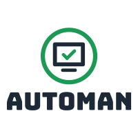
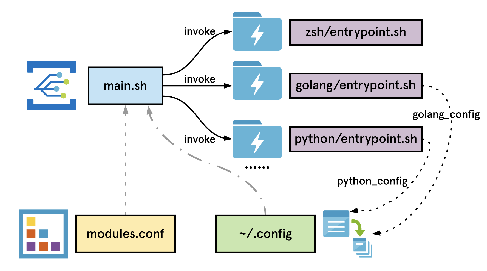

# automan

Automan is a respository of self-management development environment sync tools, which uses configuration file and shell scripts to keep trace of developing habits.

Originally, automan is expected to be a tool for synchronization between different mac systems, especially when you change your computer during job-hopping.

It is very important to speed up your efficiency by using any automated tools.

> !!! Should be NOTICED
> 
> This repository is just a recording set to trace my personal system configuration habits.
> Not ensure that it is also suitable for you. But the meaning behind it is worth considering.

# design & components
In the v0.1 version, automan is launched by `main.sh` script, which executes many shell commands to configure global environment variables and do some setup works.

It is designed as a plugin-enable form, whose components can be specified in the `modules.conf` file. The program would search the specific module script according to the name configured in the `modules.conf` and execute the `entrypoint.sh` in the corresponding directory.

## zsh module
> 1. install homebrew if not existed

## golang module
> 1. create environment variables like GOPATH/GOBIN/...
> 2. install packages and binary executive files
> 3. attach golang config file to `~/.config`

## python module
> 1. install or update pip tool first
> 2. install third-party tools like pipenv/pyenv, etc.

## vim module
> install vimplus if not existed

## git module
> create `~/.ssh/config` to support github multi-user

# setup guide
`bash main.sh`

or
 
`make all`

# changelog
version: v0.1, date: 2020-05-07, features: install or update the basic configuration & software according to module list defined in modules.conf 

